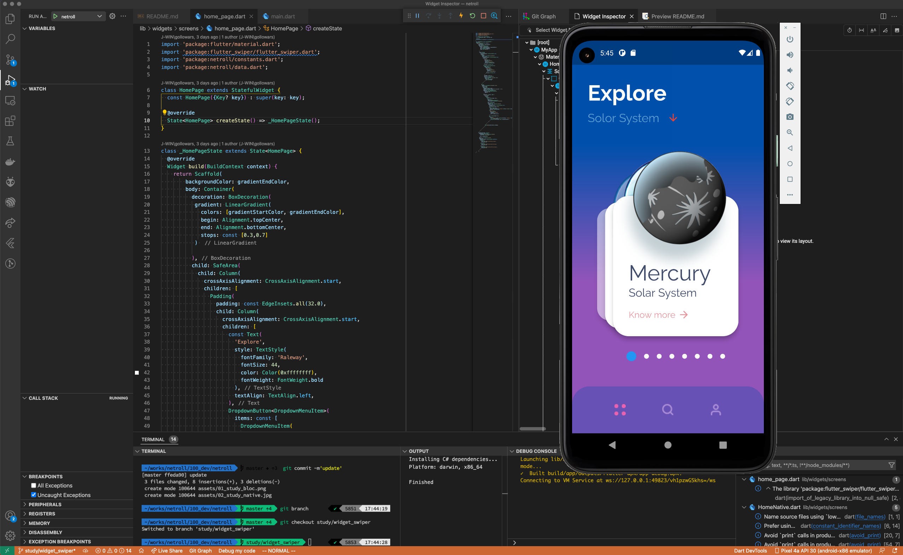
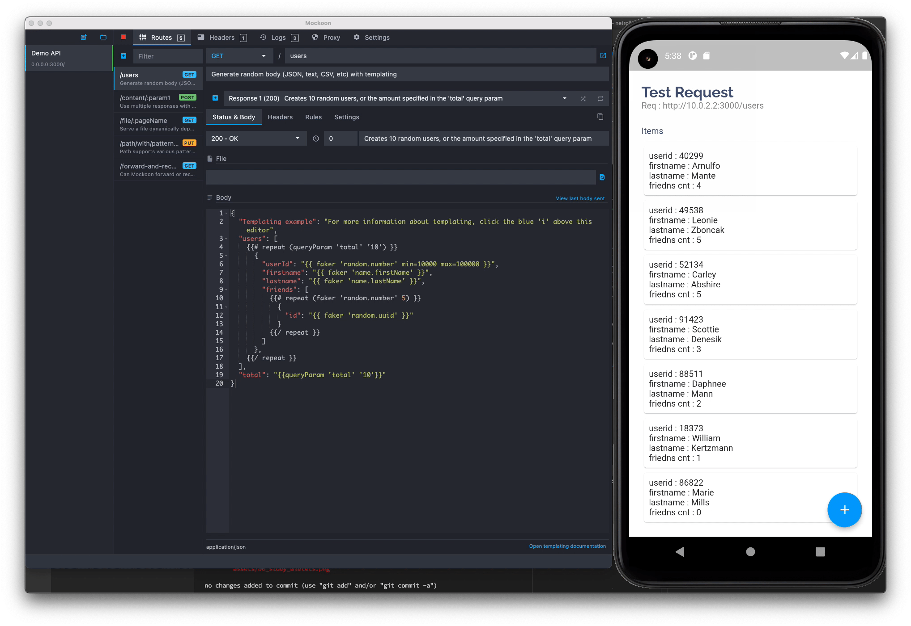
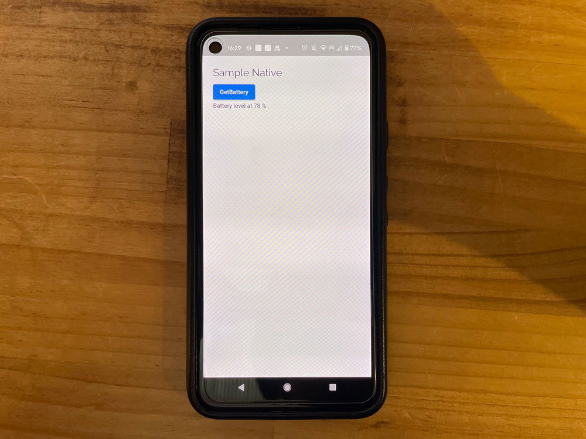
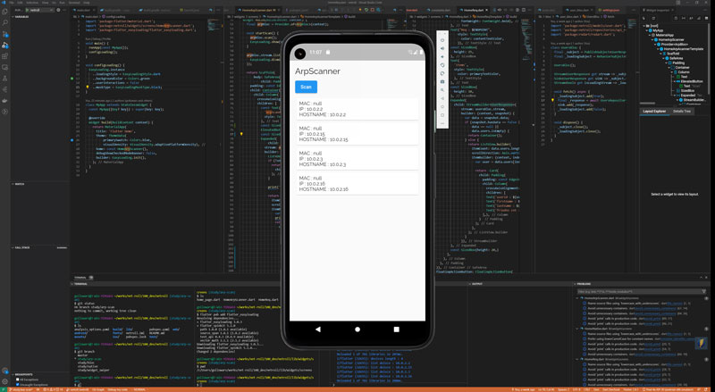
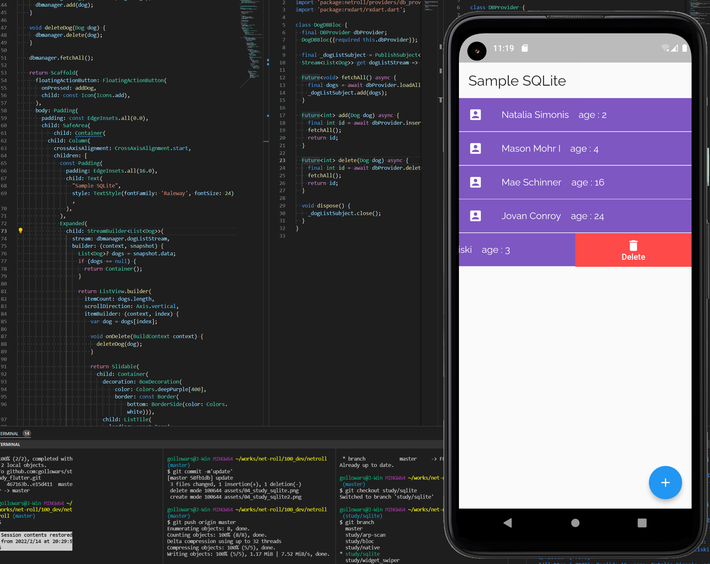

# Study Flutter Project

## check branches
### study/widget_swiper 
Learn how wigets & swiperplugin works
reference is [Flutter Design Tutorial | Minimal UI - Part 1](https://www.youtube.com/watch?v=neXfa4J752A)

---

### study/bloc 
how to use http req designed by BLoC
required : [Mockoon](https://mockoon.com/)

 - study/native (how to use native api)

 ---

### study/native 
how to use Native API
check a post [FlutterでデバイスネイティブAPIを使う。 ](https://vomit.me/articles/2022/02/09/11bf68b9fdbef6ea37282630376caa29/flutter-native-code/)

---

### study/arp-scan
arp scanner app, loading sample

---

### study/sqlite
sqlite sample on flutter using slidable
